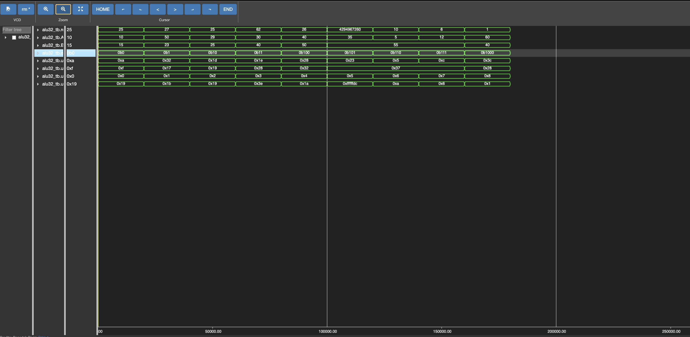

# 32-bit Arithmetic Logic Unit (ALU) using Verilog HDL

A 32-bit Arithmetic Logic Unit (ALU) designed and implemented using **Verilog HDL**. The project demonstrates arithmetic, logical, shift, and comparison operations, verified through simulation using **Icarus Verilog** and waveform analysis.

---

## 📌 Features

- 32-bit ALU Design
- Addition
- Subtraction
- Bitwise AND
- Bitwise OR
- Bitwise XOR
- Bitwise NOT
- Shift Left (<<)
- Shift Right (>>)
- Compare (A > B)
- Functional Verification using Verilog Testbench
- Waveform Analysis

---

## 🛠 Tools Used

- Verilog HDL
- Visual Studio Code
- Icarus Verilog
- VS Code Waveform Viewer / GTKWave
- Git
- GitHub

---

## 📂 Project Structure

```
32bit-ALU/
│
├── rtl/
│   └── alu32.v
│
├── tb/
│   └── alu32_tb.v
│
├── sim/
│   ├── waveform.vcd
│   └── simulation_output.txt
│
├── docs/
│   └── Project_Report.pdf
│
├── images/
│   ├── alu_architecture.png
│   └── waveform.png
│
├── README.md
├── LICENSE
└── .gitignore
```

---

## ⚙️ Supported Operations

| Opcode | Operation |
|---------|-----------|
| 0000 | Addition |
| 0001 | Subtraction |
| 0010 | AND |
| 0011 | OR |
| 0100 | XOR |
| 0101 | NOT |
| 0110 | Shift Left |
| 0111 | Shift Right |
| 1000 | Compare |

---

## ▶️ How to Compile

```bash
iverilog -o alu rtl/alu32.v tb/alu32_tb.v
```

---

## ▶️ Run the Simulation

```bash
vvp alu
```

---

## 📈 Sample Simulation Output

```text
Time=0      A=10  B=15  opcode=0000  result=25
Time=20000  A=50  B=23  opcode=0001  result=27
Time=40000  A=29  B=25  opcode=0010  result=25
Time=60000  A=30  B=40  opcode=0011  result=62
Time=80000  A=40  B=50  opcode=0100  result=26
```

---

## 📷 Waveform

Add your waveform screenshot here after uploading it to the `images` folder.

```markdown

```

---

## 🏗 ALU Architecture

Add your ALU block diagram here after uploading it to the `images` folder.

```markdown

```

---

## 📄 Documentation

A detailed project report is available in:

```
docs/Project_Report.pdf
```

---

## 🚀 Future Improvements

- Overflow Detection
- Carry Flag
- Zero Flag
- Sign Flag
- Multiplication
- Division
- Barrel Shifter
- Self-checking Testbench

---

## 👨‍💻 Author

**Ramkrupakiran Akkarapaka**

B.Tech – Electronics and Communication Engineering

Atria Institute of Technology

---

## ⭐ If you found this project useful, consider giving it a Star!